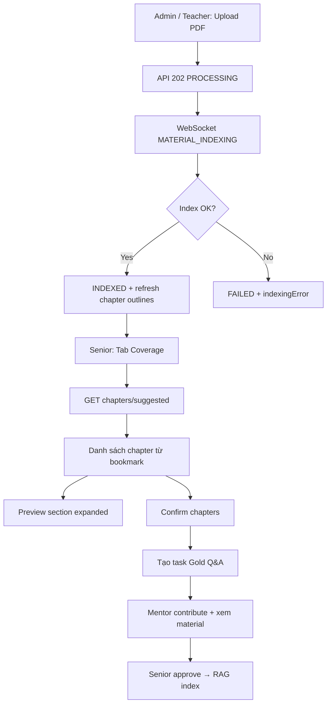

# Hướng dẫn UI/UX — Tài liệu môn học & Coverage V2 (FE Website)

Tài liệu dành cho team **FE Website** thiết kế và implement giao diện quản lý giáo trình, mục lục chapter, và luồng Expert Co-Training V2.

**Backend base URL (local):** `http://localhost:8085`
**Auth:** `Authorization: Bearer <JWT>`
**Swagger:** `/swagger-ui.html`

---

## 1. Tóm tắt nghiệp vụ

| Khái niệm | Ý nghĩa cho UI |
|---|---|
| **Course Material** | PDF/HTML/text đã upload cho một môn (`courseId`). Dùng cho RAG tutor & quiz. |
| **Indexing** | Trích text → chunk → embed Elasticsearch. Trạng thái: `PROCESSING` → `INDEXED` / `FAILED`. |
| **PDF Bookmark (TOC)** | Mục lục gốc trong PDF (sidebar bookmark). Mỗi mục = 1 chapter gợi ý. |
| **Chapter Outline** | Danh sách chapter senior dùng cho coverage & Gold Q&A. |
| **Coverage Gap** | Chapter thiếu Gold Q&A training/evaluation. |
| **Gold Q&A** | Cặp câu hỏi–đáp chuẩn do mentor đóng góp, senior duyệt. |

**Quy tắc quan trọng (2026-03):**

- PDF **có bookmark** → hệ thống gợi ý chapter theo mục lục (`detectedFrom = PDF_BOOKMARK`).
- PDF **không có bookmark** → fallback **1 file = 1 chapter** theo tên upload (`MATERIAL_TITLE`).
- Không dùng regex heading từ text PDF (tránh noise kiểu `0 1 0 2...`).
- Preview chapter `expanded=true` với `PDF_BOOKMARK` → trả **full nội dung section** (theo page range), không cắt 12k.

---

## 2. Vai trò & quyền màn hình

| Role | Màn hình chính |
|---|---|
| **ADMIN** | Upload tài liệu **chung course**, quản lý materials, academic hub |
| **TEACHER** (mentor) | Upload tài liệu **theo lớp**, xem task, đóng góp Gold Q&A, xem material chapter |
| **SENIOR_MENTOR** | Tab Coverage, confirm chapter, tạo task, duyệt Gold Q&A/rubric, chạy eval |
| **STUDENT** | Không vào dashboard material/coverage V2 |

---

## 3. Sơ đồ luồng (Information Architecture)



---

## 4. Màn hình FE cần làm

### 4.1. Danh sách tài liệu môn (`/courses/:courseId/materials`)

**Đối tượng:** Admin (course shared), Teacher (class section).

**API:**

```http
GET /api/courses/{courseId}/materials?classId=&indexingStatus=
```

**Response item (`CourseMaterialSummary`):**

```json
{
  "id": "67abc...",
  "title": "Modern Operating Systems 4th Edition",
  "sourceFileName": "OSG4.pdf",
  "sourceType": "PDF",
  "indexingStatus": "INDEXED",
  "indexedAt": "2026-03-21T10:00:00",
  "indexingError": null,
  "pageCount": 1056,
  "tocItemCount": 42,
  "hasPdf": true,
  "pdfFileId": "...",
  "pdfFileSize": 12500000,
  "materialScope": "COURSE_SHARED",
  "uploadedByRole": "ADMIN"
}
```

**UI/UX gợi ý:**

| Thành phần | Chi tiết |
|---|---|
| Card mỗi tài liệu | Title, file name, badge trạng thái index |
| Metadata | `{pageCount} trang · {tocItemCount} mục lục` (nếu > 0) |
| Actions | Xem PDF, Re-index, Sửa title, Xóa |
| Trạng thái | `PROCESSING` → spinner + "Đang index..." |
| | `INDEXED` → badge xanh "Đã index" |
| | `FAILED` → badge đỏ + tooltip `indexingError` |
| Empty state | "Chưa có tài liệu" + CTA Upload |
| Realtime | Lắng nghe WebSocket (mục 8) để cập nhật badge không cần F5 |

**Lưu ý field:** Backend trả `indexingStatus`, không phải `indexStatus`. Map cả hai nếu cần tương thích cũ.

---

### 4.2. Upload tài liệu PDF

**API:**

```http
POST /api/courses/{courseId}/materials/upload
Content-Type: multipart/form-data

title: Foundations of CS
file: <pdf>
classId: (optional, teacher)
teacherId: (optional)
uploaderRole: ADMIN | TEACHER
```

**Response 202:**

```json
{
  "materialId": "...",
  "indexingStatus": "PROCESSING",
  "pageCount": null,
  "tocItemCount": 0,
  "message": "Material uploaded. Indexing is running in background."
}
```

**UI/UX gợi ý:**

1. Form: Title (required) + file picker (.pdf, max 50MB).
2. Sau submit: đóng modal, thêm card trạng thái `PROCESSING`.
3. Không block UI — indexing chạy nền.
4. Khi `MATERIAL_INDEXED`: cập nhật card + toast "Index xong".
5. Nếu `FAILED`: hiện lỗi (PDF scan/OCR không hỗ trợ).

**Copy gợi ý:**

- Title nên đặt tên sách/giáo trình, vd. *Foundations of Computer Science*.
- Chapter con sẽ lấy từ **bookmark PDF**, không cần nhập tay từng chapter khi upload.

---

### 4.3. Xem PDF gốc

**API:**

```http
GET /api/courses/{courseId}/materials/{materialId}/pdf
```

→ Binary PDF (mở tab mới hoặc embed PDF viewer).

**UI/UX:** Luôn có nút **"Mở PDF"** ở:
- Card tài liệu
- Panel preview chapter
- Màn mentor contribute

---

### 4.4. Chi tiết tài liệu (full text — admin/debug)

**API:**

```http
GET /api/courses/{courseId}/materials/{materialId}
```

Trả full entity gồm `content` (toàn bộ text đã extract), `tableOfContents[]`, `pageCount`.

**UI/UX:** Chỉ dùng cho màn admin/debug hoặc "Xem raw text". **Không** dùng API này cho preview chapter hàng ngày — dùng API preview V2 (mục 4.5).

**TOC item shape:**

```json
{
  "title": "1.1 Turing Model",
  "level": 1,
  "pageStart": 12,
  "pageEnd": 18
}
```

Có thể render tree mục lục read-only trên trang chi tiết tài liệu.

---

### 4.5. Tab Coverage — Chapters gợi ý (Senior)

**Vị trí:** Expert Co-Training V2 → tab **Coverage** (hoặc Academic → Coverage).

**API chính:**

```http
GET /api/v2/expert-training/chapters/suggested?courseId=OSG203
```

**Response:**

```json
{
  "chapters": [
    {
      "id": "...",
      "courseId": "OSG203",
      "chapterKey": "chapter-1-introduction",
      "title": "Chapter 1: Introduction",
      "status": "SUGGESTED",
      "detectedFrom": "PDF_BOOKMARK",
      "tocLevel": 0,
      "pageStart": 10,
      "pageEnd": 39,
      "chunkCount": 12,
      "approxChars": 18500,
      "materialHealth": "MATERIAL_OK",
      "trainingGoldCount": 0,
      "evaluationGoldCount": 0,
      "sourceMaterialIds": ["67abc..."]
    },
    {
      "title": "1.1 Turing Model",
      "detectedFrom": "PDF_BOOKMARK",
      "tocLevel": 1,
      "pageStart": 12,
      "pageEnd": 18,
      "materialHealth": "MATERIAL_OK"
    }
  ]
}
```

**UI/UX — danh sách chapter:**

| Element | Spec |
|---|---|
| Hierarchy | Indent theo `tocLevel`: level 0 = chapter lớn, level 1 = mục con (1.1, 1.2...) |
| Checkbox | Multi-select để confirm |
| Subtitle | `{detectedFrom} · {chunkCount} chunks · p.{pageStart}-{pageEnd} · Gold T/E: {training}/{evaluation}` |
| Badge `materialHealth` | Xem bảng mục 7 |
| Click row | Mở **drawer/modal preview** (không navigate sang trang mới) |
| Refresh | Gọi lại `suggested` — backend tự refresh outline + backfill bookmark PDF cũ |
| Empty | "Upload và index giáo trình trước" |

**Copy header tab:**

> Chapters gợi ý từ mục lục PDF (bookmark). Nếu PDF không có bookmark, hệ thống dùng tên tài liệu làm 1 chapter.

**Thêm chapter thủ công:**

```http
POST /api/v2/expert-training/chapters/manual
{
  "courseId": "OSG203",
  "title": "Servlet Filter & Listener",
  "createdBy": "<seniorId>",
  "confirmImmediately": true
}
```

Dialog: 1 text field "Tên chapter" — phải khớp chính xác khi tạo Gold Q&A sau này.

**Confirm chapters:**

```http
POST /api/v2/expert-training/chapters/confirm
{
  "courseId": "OSG203",
  "chapterKeys": ["chapter-1-introduction", "1-1-turing-model"],
  "confirmedBy": "<seniorId>"
}
```

---

### 4.6. Preview nội dung chapter (Drawer / Side panel)

**API (Coverage — theo chapterKey):**

```http
GET /api/v2/expert-training/chapters/{chapterKey}/preview?courseId=OSG203&expanded=true
```

**API (Mentor task — theo title):**

```http
GET /api/v2/expert-training/chapters/preview?courseId=OSG203&chapter=1.1%20WHAT%20IS%20AN%20OPERATING%20SYSTEM%3F&expanded=true
```

**Response (`ChapterPreviewView`):**

```json
{
  "courseId": "OSG203",
  "chapterKey": "1-1-what-is-an-operating-system",
  "title": "1.1 WHAT IS AN OPERATING SYSTEM?",
  "detectedFrom": "PDF_BOOKMARK",
  "materialHealth": "MATERIAL_OK",
  "chunkCount": 9,
  "approxChars": 4500,
  "excerpt": "... full section text ...",
  "excerptTruncated": false,
  "excerptTotalChars": 8200,
  "hasMaterialContent": true,
  "sourceMaterials": [
    {
      "id": "67abc...",
      "title": "Modern Operating Systems 4th Edition",
      "sourceType": "PDF",
      "indexingStatus": "INDEXED"
    }
  ]
}
```

**UI/UX — layout drawer (desktop):**

```
┌─────────────────────────────────────────────┐
│ 1.1 WHAT IS AN OPERATING SYSTEM?        [×] │
│ [Material OK]                               │
│ PDF_BOOKMARK · 9 chunks · p.3-8             │
├─────────────────────────────────────────────┤
│ Tài liệu nguồn                              │
│ • Modern Operating Systems 4th Ed  [Mở PDF] │
├─────────────────────────────────────────────┤
│ Nội dung mục đã map                         │
│ ┌─────────────────────────────────────────┐ │
│ │ (scroll area, monospace hoặc body text) │ │
│ │ Selectable text, full section           │ │
│ └─────────────────────────────────────────┘ │
│ ⚠ Chỉ hiện khi excerptTruncated=true:       │
│   "Bản rút gọn (2500/8200 ký tự). Mở PDF."  │
├─────────────────────────────────────────────┤
│ [Tạo task Gold Q&A cho chapter này]         │
└─────────────────────────────────────────────┘
```

**Quy tắc hiển thị excerpt:**

| `expanded` | `detectedFrom` | Hành vi UI |
|---|---|---|
| `false` | bất kỳ | Excerpt rút gọn ~2.500 ký tự — dùng cho tooltip/list nhỏ |
| `true` | `PDF_BOOKMARK` | **Full section** theo page range — scroll dài OK |
| `true` | `MATERIAL_TITLE` | Có thể vẫn rút gọn nếu là cả cuốn sách — khuyến khích Mở PDF |

**Mobile:** `DraggableScrollableSheet` hoặc full-screen modal, `expanded=true` bắt buộc.

---

### 4.7. Coverage gaps & tạo task

**Phân tích coverage:**

```http
POST /api/v2/expert-training/coverage/analyze
{
  "courseId": "OSG203",
  "chapters": [],
  "minimumTrainingGoldPerChapter": 3,
  "minimumEvaluationGoldPerChapter": 2,
  "requestedBy": "<seniorId>",
  "createTasks": false
}
```

`chapters: []` = phân tích tất cả chapter đã confirm (hoặc suggested nếu chưa confirm).

**Smart policy:** Khi chapter `materialHealth = MATERIAL_OK`, mặc định **không** auto-tạo task — senior tạo thủ công.

**Tạo task cho 1 chapter:**

```http
POST /api/v2/expert-training/chapters/tasks
{
  "courseId": "OSG203",
  "chapter": "1.1 WHAT IS AN OPERATING SYSTEM?",
  "createdBy": "<seniorId>",
  "includeTrainingGoldTask": true,
  "includeEvaluationGoldTask": true
}
```

**UI:** Nút trong drawer preview + bulk action trên tab Coverage.

---

### 4.8. Mentor — Expert Contribute (xem tài liệu khi làm task)

**Luồng:**

1. `GET /tasks?courseId=&assigneeId=` → task có field `chapter` (string title).
2. Panel **"Tài liệu chương"** gọi preview by title với `expanded=true`.
3. Hiển thị excerpt + nút Mở PDF cho từng `sourceMaterials[]`.

**UX:** Panel collapsible, mặc định mở — giúp mentor đọc giáo trình khi viết Gold Q&A.

---

## 5. Bảng `detectedFrom` — label UI

| Giá trị | Label đề xuất | Ý nghĩa |
|---|---|---|
| `PDF_BOOKMARK` | Mục lục PDF | Chapter từ bookmark gốc |
| `MATERIAL_TITLE` | Tên tài liệu | 1 file = 1 chapter (PDF không có bookmark) |
| `MANUAL` | Thêm thủ công | Senior tự thêm |
| `HEADING` | (legacy) | **Không hiển thị** — backend đánh IGNORED |

---

## 6. Bảng `materialHealth` — badge màu

| Giá trị | Label VI | Màu gợi ý | Hành động UI |
|---|---|---|---|
| `MATERIAL_OK` | Material OK | Xanh | Cho phép tạo task / contribute |
| `MATERIAL_THIN` | Material mỏng | Vàng | Cảnh báo: ít nội dung (< 3 chunks hoặc < 1500 chars) |
| `NO_MATERIAL` | Chưa có material | Xám | Gợi ý upload/re-index |

---

## 7. Trạng thái indexing — badge

| `indexingStatus` | UI |
|---|---|
| `PROCESSING` | Spinner + "Đang index..." |
| `INDEXED` | ✓ Đã index |
| `FAILED` | ✗ Lỗi — hiện `indexingError` |

**Lỗi thường gặp:**

- PDF scan/ảnh → "Could not extract enough text... OCR required"
- File > 50MB → từ chối upload

---

## 8. WebSocket — cập nhật realtime

**Endpoint:** `ws(s)://<host>/ws/events?token=<JWT>`

**Events liên quan material:**

| Event type | Payload gợi ý | Hành động FE |
|---|---|---|
| `MATERIAL_INDEXING` | `{ materialId, courseId, indexingStatus: "PROCESSING" }` | Cập nhật card → spinner |
| `MATERIAL_INDEXED` | `{ materialId, indexingStatus: "INDEXED" }` | Badge xanh + invalidate list Coverage |
| `MATERIAL_INDEXING_FAILED` | `{ materialId, indexingError }` | Badge đỏ + toast |

Không reload trang — chỉ invalidate query cache (React Query / SWR / RTK Query).

---

## 9. Responsive & component checklist

### Desktop (≥1024px)

- [ ] Bảng materials + sidebar filter theo `indexingStatus`
- [ ] Coverage: master-detail (list trái, preview phải) hoặc drawer phải 480px
- [ ] PDF mở tab mới hoặc split view

### Tablet / Mobile

- [ ] Materials: card list + FAB upload
- [ ] Coverage: list → bottom sheet preview full height 72–95vh
- [ ] Excerpt: `overflow-y: auto`, `-webkit-overflow-scrolling: touch`
- [ ] Text `user-select: text` để copy đoạn học thuật

### Accessibility

- [ ] Checkbox chapter có `aria-label` đầy đủ title
- [ ] Badge health không chỉ dùng màu — có text
- [ ] Loading skeleton cho list materials & chapters

---

## 10. API map nhanh (copy cho FE)

### Materials

| Method | Path | Mục đích |
|---|---|---|
| GET | `/api/courses/{courseId}/materials` | List (không có `content`) |
| GET | `/api/courses/{courseId}/materials/{id}` | Detail (+ content + TOC) |
| GET | `/api/courses/{courseId}/materials/{id}/pdf` | Download PDF |
| POST | `/api/courses/{courseId}/materials/upload` | Upload PDF |
| POST | `/api/courses/{courseId}/materials/{id}/reindex` | Re-index |
| DELETE | `/api/courses/{courseId}/materials/{id}` | Xóa |
| POST | `/api/courses/{courseId}/materials/url-toc` | Preview TOC HTML |
| POST | `/api/courses/{courseId}/materials/import-url` | Import HTML |

### V2 Chapters & Coverage

| Method | Path | Mục đích |
|---|---|---|
| GET | `/api/v2/expert-training/chapters/suggested?courseId=` | List chapter gợi ý |
| POST | `/api/v2/expert-training/chapters/confirm` | Confirm chapters |
| POST | `/api/v2/expert-training/chapters/manual` | Thêm chapter tay |
| GET | `/api/v2/expert-training/chapters/{key}/preview?courseId=&expanded=` | Preview theo key |
| GET | `/api/v2/expert-training/chapters/preview?courseId=&chapter=&expanded=` | Preview theo title |
| POST | `/api/v2/expert-training/chapters/tasks` | Tạo task cho chapter |
| POST | `/api/v2/expert-training/coverage/analyze` | Phân tích gap |
| GET | `/api/v2/expert-training/coverage-gaps?courseId=` | List gaps |

Chi tiết V2 đầy đủ: xem `TUTOR_V2_IMPLEMENTATION_AND_TEST_GUIDE_VI.md`.

---

## 11. Anti-patterns — tránh trên UI

| ❌ Không làm | ✅ Nên làm |
|---|---|
| Gọi list materials rồi expect có `content` | Dùng preview API hoặc detail API riêng |
| Hiển thị excerpt không scroll | Scroll container cố định chiều cao |
| Preview Coverage với `expanded=false` | Luôn `expanded=true` khi mở drawer |
| Tự parse chapter từ text PDF ở FE | Tin `chapters/suggested` từ backend |
| Hardcode 1 file = 1 chapter trên UI | Kiểm tra `detectedFrom` |
| Reload trang khi index xong | WebSocket + cache invalidation |

---

## 12. Wireframe text — Coverage tab (ASCII)

```
┌─ Expert Co-Training V2 ─────────────────────────────────────┐
│ [Tasks] [Coverage] [Review] [Eval]          Course: [OSG203▼]│
├──────────────────────────────────────────────────────────────┤
│ Chapters gợi ý từ giáo trình đã index                       │
│ Gợi ý từ mục lục PDF (bookmark) hoặc tên tài liệu.         │
│ [+ Thêm chapter thủ công]                                   │
│                                                              │
│ ☑ Chapter 1: Introduction          [Material OK]      p.10-39│
│ ☑   1.1 Turing Model               [Material OK]      p.12-18│
│ ☑   1.2 Von Neumann Model          [Material OK]      p.19-25│
│ ☐ Chapter 2: Number Systems        [Material OK]      p.40-..│
│                                                              │
│ [Xác nhận chapters đã chọn]  [Phân tích coverage]           │
├──────────────────────────────────────────────────────────────┤
│ Coverage gaps                                                │
│ • 1.1 WHAT IS AN OS — thiếu 3 Gold Training                  │
└──────────────────────────────────────────────────────────────┘
```

---

## 13. Checklist bàn giao FE

- [ ] Map đúng `indexingStatus` từ API
- [ ] Hiển thị `pageCount`, `tocItemCount` trên card material
- [ ] Coverage list indent theo `tocLevel`
- [ ] Preview drawer: `expanded=true`, scroll, SelectableText
- [ ] Nút Mở PDF ở material card + preview drawer + mentor panel
- [ ] Xử lý `excerptTruncated` + fallback Mở PDF
- [ ] WebSocket cập nhật trạng thái index
- [ ] Empty/error states có CTA rõ ràng
- [ ] Role guard: Student không thấy menu Coverage/Materials admin

---

## 14. Liên hệ tài liệu liên quan

| File | Nội dung |
|---|---|
| `FE_WEBSITE_V2_EXPERT_COTRAINING_UIUX_GUIDE_VI.md` | **Hub V2 đầy đủ:** Tasks, Coverage, Duyệt, Eval, Contribute (parity mobile) |
| `TUTOR_V2_IMPLEMENTATION_AND_TEST_GUIDE_VI.md` | API V2 đầy đủ, Gold Q&A, eval |
| `FE_EDUCATION_DEMO_AND_REALTIME_GUIDE_VI.md` | WebSocket, auth, demo flow |
| `FRONTEND_N8N_INTEGRATION_GUIDE.md` | n8n webhook (không dùng cho upload PDF) |

**Ghi chú:** Upload/index PDF **không** đi qua n8n — FE gọi trực tiếp Spring Boot API.

---

*Tài liệu cập nhật: 2026-03-21 — phản ánh PDF bookmark chapters + full section preview.*
