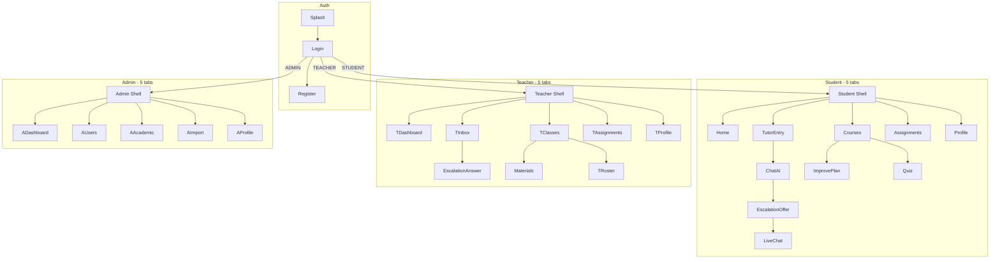

# AI Tutor FPT — Nghiệp vụ & Mục đích Mobile App

> Tài liệu mô tả **mục đích**, **nghiệp vụ** và **danh sách màn hình (page)** của ứng dụng mobile Flutter trong dự án AI Tutor FPT University.  
> Backend tham chiếu: `ai-tutor-api` (Spring Boot + MongoDB + Elasticsearch + n8n).

---

## 1. Mục đích dự án

**AI Tutor FPT** là ứng dụng mobile hỗ trợ học tập cho sinh viên và giảng viên Đại học FPT, tích hợp trí tuệ nhân tạo (RAG) dựa trên **tài liệu môn học thật**.

### Vấn đề cần giải quyết

| Vấn đề | Giải pháp của app |
|--------|-------------------|
| Sinh viên hỏi bài ngoài giờ, không có người trả lời ngay | AI Tutor trả lời theo phạm vi môn học (RAG) |
| Câu trả lời AI không đủ tin cậy | Escalation → mentor/giảng viên hỗ trợ qua live chat |
| Sinh viên học lệch, không biết điểm yếu | Memory + Improve Plan + Quiz tự luyện |
| Giảng viên quản lý lớp, bài tập, tài liệu rời rạc | Dashboard, inbox, chấm bài, upload tài liệu trên một app |
| Tri thức mới cần được kiểm duyệt trước khi AI học | Senior duyệt Knowledge Candidate |

### Mục tiêu sản phẩm

1. **Học có ngữ cảnh** — AI chỉ trả lời trong phạm vi `courseId` / tài liệu đã index.
2. **Minh bạch & đáng tin** — Hiển thị độ tin cậy, cho phép đánh giá / báo lỗi câu trả lời.
3. **Human-in-the-loop** — Escalation, mentor chat, senior duyệt tri thức.
4. **Một app, nhiều vai trò** — Sinh viên, giảng viên, senior, admin dùng chung codebase, UI đổi theo role sau đăng nhập.

### Đối tượng sử dụng

| Vai trò | Mô tả |
|---------|--------|
| **STUDENT** | Sinh viên FPT — hỏi AI, nộp bài, làm quiz, xem kế hoạch cải thiện |
| **TEACHER / MENTOR** | Giảng viên — quản lý lớp, tài liệu, bài tập, inbox escalation, chấm bài |
| **SENIOR_MENTOR** | Mentor cấp cao — duyệt knowledge candidate, xử lý review queue |
| **ADMIN** | Quản trị hệ thống — user, học thuật, import, subscription |

---

## 2. Kiến trúc ứng dụng

| Thành phần | Công nghệ |
|------------|-----------|
| Mobile | Flutter 3.9+, Riverpod, go_router |
| API chính | Spring Boot REST (`:8085`) |
| AI orchestration | n8n webhooks (review, teacher answer, senior approval) |
| Auth | JWT Bearer token |
| Ngôn ngữ UI | Tiếng Việt |

**Mô hình điều hướng:** Một app → đăng nhập → redirect theo role → shell riêng (bottom nav) cho Student / Teacher / Admin.

---

## 3. Luồng nghiệp vụ chính

### 3.1 Sinh viên — Hỏi AI (core flow)

```
Chọn môn học → Tạo/mở hội thoại → Gửi câu hỏi
    → POST /api/ai/query (RAG / CODE / ESCALATE)
    → Hiển thị câu trả lời + đánh giá (👍👎)
    → (Tuỳ chọn) Escalation → chọn mentor → Live chat
```

### 3.2 Sinh viên — Code Mentor

```
Dán code + câu hỏi → POST /api/code-mentor/query
    → Nhận gợi ý / giải thích (không làm hộ bài tập)
```

### 3.3 Escalation → Live chat

```
AI không chắc / sinh viên yêu cầu
    → POST /api/tutor/escalations/offer
    → Chọn mentor → POST /api/tutor/escalations/select
    → Mở phòng chat → polling /api/chat/*
```

### 3.4 Memory & Improve Plan

```
Sau mỗi lần học → cập nhật weak topics
    → Sinh gợi ý ôn tập → Ghim / Học ngay / Tạo quiz
    → Kế hoạch cải thiện theo môn (checklist)
```

### 3.5 Bài tập & Quiz

| Loại | Sinh viên | Giảng viên |
|------|-----------|------------|
| **File assignment** | Xem, tải, nộp file | Upload đề, xem submissions, chấm điểm |
| **Quiz tự luyện** | Generate từ topic → làm → submit | — |
| **Quiz assignment** | Làm bài được giao | Tạo draft → publish → review điểm AI |

### 3.6 Giảng viên — Inbox

Ba hàng đợi: **Live chat** · **Escalation** · **Review AI** (mentor-pending).

### 3.7 Senior / Admin — Tri thức AI

```
Giảng viên trả lời escalation + đề xuất knowledge
    → Senior duyệt candidate → index vào Elasticsearch (RAG brain)
```

---

## 4. Danh sách Page (màn hình)

> **Ký hiệu:**  
> `[Tab]` = có trong bottom navigation  
> `[Sub]` = màn con, điều hướng từ màn khác  
> `[Shared]` = dùng chung nhiều role  
> `[Modal]` = push bằng Navigator, không có route go_router riêng  

---

### 4.1 Auth & Khởi động

| Page | Route | Mục đích |
|------|-------|----------|
| **Splash** | `/splash` | Kiểm tra session đã lưu, chuyển hướng login hoặc home |
| **Đăng nhập** | `/login` | Đăng nhập email/password, JWT |
| **Đăng ký** | `/register` | Tạo tài khoản sinh viên mới |

---

### 4.2 Sinh viên (Student Shell)

Bottom nav: **Trang chủ · Môn học · Ask Cóc · Bài tập · Hồ sơ**

| Page | Route | Loại | Mục đích |
|------|-------|------|----------|
| **Trang chủ** | `/s/home` | Tab | Dashboard: chào user, thống kê, danh sách môn, shortcut AI Tutor |
| **Môn học** | `/s/courses` | Tab | Chọn môn đang học; xem memory chip, link Improve Plan / Quiz / AI |
| **Ask Cóc (Entry)** | `/s/tutor` | Tab | Tự động tạo hội thoại mới → chuyển sang Chat |
| **Chat AI** | `/s/tutor/:conversationId` | Sub | Hỏi đáp AI theo môn; sidebar lịch sử hội thoại; ghim/copy/review |
| **Code Mentor** | `/s/tutor/code-mentor` | Sub | Hỏi về code, debug, hint (không giải hộ) |
| **Bài tập** | `/s/assignments` | Tab | Danh sách bài tập (chờ nộp / đã nộp) |
| **Chi tiết bài tập** | `/s/assignments/:id` | Sub | Xem mô tả, hạn nộp, tải file đề |
| **Nộp bài** | `/s/assignments/:id/submit` | Sub | Upload file bài làm |
| **Quiz theo môn** | `/s/quiz/:courseId` | Sub | Tab tự luyện + quiz được giao |
| **Làm quiz** | — | Modal | Màn làm bài quiz (generate / session / assignment) |
| **Hồ sơ** | `/s/profile` | Tab | Thông tin cá nhân, cài đặt, đăng xuất |
| **Kế hoạch cải thiện** | `/s/profile/improve/:courseId` | Sub | Weak topics, checklist ôn tập, gợi ý đã ghim |
| **Lịch sử escalation** | `/s/profile/escalations` | Sub | Xem các lần nhờ mentor hỗ trợ |
| **Đề xuất mentor** | `/s/escalation/:id/offer` | Sub | Chọn mentor sau khi AI escalate |
| **Drawer lịch sử chat** | — | UI | Sidebar trong Chat — tìm/đổi tên/xóa hội thoại |

---

### 4.3 Giảng viên / Mentor (Teacher Shell)

Bottom nav: **Trang chủ · Lớp học · Hộp thư · Bài tập · Hồ sơ**

| Page | Route | Loại | Mục đích |
|------|-------|------|----------|
| **Dashboard GV** | `/t/home` | Tab | Thống kê lớp, escalation chờ, hoạt động gần đây |
| **Danh sách lớp** | `/t/classes` | Tab | Các lớp đang dạy theo môn |
| **Danh sách sinh viên** | `/t/classes/:courseId/:classId/students` | Sub | Roster lớp |
| **Tài liệu lớp** | `/t/classes/:courseId/:classId/materials` | Sub | Upload PDF, import URL, reindex, xóa tài liệu RAG |
| **Bài tập của lớp** | `/t/classes/:courseId/:classId/assignments` | Sub | Quản lý đề bài theo lớp |
| **Submissions lớp** | `/t/classes/:courseId/:classId/assignments/submissions` | Sub | Tổng hợp bài nộp theo lớp |
| **Hộp thư** | `/t/inbox` | Tab | 3 tab: Live chat · Escalation · Review AI |
| **Trả lời escalation** | `/t/inbox/escalations/:id/answer` | Sub | Soạn câu trả lời, đề xuất knowledge candidate |
| **Bài tập (tổng)** | `/t/assignments` | Tab | Danh sách assignment đã tạo |
| **Submissions bài** | `/t/assignments/:id/submissions` | Sub | Bài nộp của một assignment |
| **Chấm bài** | `/t/submissions/:id/grade` | Sub | Nhập điểm, feedback, weak topics |
| **Quiz (GV)** | `/t/quiz` | Sub | Tạo/sửa/publish quiz assignment, review điểm |
| **Hồ sơ GV** | `/t/profile` | Tab | Profile, dark mode, menu senior (nếu có quyền) |
| **Senior review queue** | `/t/review/senior-pending` | Sub | Hàng đợi review câu trả lời AI (senior) |
| **Knowledge candidates** | `/t/candidates` | Sub | Danh sách tri thức chờ duyệt |
| **Chi tiết candidate** | `/t/candidates/:id` | Sub | Approve / reject tri thức |

---

### 4.4 Admin (Admin Shell)

Bottom nav: **Dashboard · Người dùng · Học thuật · Import · Hồ sơ**

| Page | Route | Loại | Mục đích |
|------|-------|------|----------|
| **Dashboard Admin** | `/a/home` | Tab | Thống kê hệ thống, shortcut quản lý |
| **Quản lý người dùng** | `/a/users` | Tab | CRUD user, filter role/trạng thái |
| **Quản lý học thuật** | `/a/academic` | Tab | Kỳ học, môn, lớp, enrollment, roster |
| **Tài liệu môn (Admin)** | `/a/academic/courses/:courseId/materials` | Sub | Upload tài liệu chung cả môn (COURSE_SHARED) |
| **Import** | `/a/import` | Tab | Import mentor + sinh viên (Excel/CSV) |
| **Subscriptions** | `/a/subscriptions` | Sub | Quản lý gói đăng ký (legacy) |
| **Mentors** | `/a/mentors` | Sub | Danh sách mentor hệ thống |
| **Mentor escalations** | `/a/mentor-escalations` | Sub | Giám sát escalation toàn hệ thống |
| **Senior queue (Admin)** | `/a/review/senior-pending` | Sub | Review queue (admin truy cập) |
| **Candidates (Admin)** | `/a/candidates` | Sub | Knowledge candidates (admin truy cập) |
| **Hồ sơ Admin** | `/a/profile` | Tab | Profile admin |

---

### 4.5 Dùng chung (Shared)

| Page | Route | Mục đích |
|------|-------|----------|
| **Live chat mentor** | `/chat/:chatRoomId` | Chat real-time (polling) giữa SV và mentor sau escalation |
| **Thông báo** | `/notifications` | Tổng hợp unread chat, bài tập chờ, inbox (client-side) |
| **Sửa hồ sơ** | `/profile/edit` | Cập nhật tên, avatar, thông tin liên hệ |
| **Đổi mật khẩu** | `/profile/change-password` | Đổi password |

---

## 5. Bản đồ điều hướng tổng quan



---

## 6. Phạm vi & giới hạn hiện tại

| Tính năng | Trạng thái |
|-----------|------------|
| Đăng nhập email/password | ✅ |
| Google Sign-in | ⏳ Coming soon |
| Quên mật khẩu | ⏳ Coming soon |
| Sinh viên xem PDF tài liệu môn | ❌ Chưa có màn riêng |
| Gợi ý ôn tập trong chat | ⏸ Tạm ẩn (`AppFlags`) |
| Nguồn tài liệu trong bubble AI | 🚫 Luôn lọc khỏi nội dung hiển thị |
| WebSocket / push notification | ❌ Dùng REST polling |
| Onboarding 3 trang | ❌ Chưa triển khai |

---

## 7. Liên kết tài liệu liên quan

| File | Nội dung |
|------|----------|
| `MOBILE_DESIGN_GUIDE.md` | Design system, UI blueprint, API map |
| `lib/core/router/routes.dart` | Định nghĩa route constants |
| `lib/core/router/app_router.dart` | Cấu hình go_router đầy đủ |
| Backend `BACKEND_API_FE_HANDOFF.md` | API catalog & smoke test |

---

*Tài liệu cập nhật theo codebase Flutter tại `ai_tutor` — tháng 7/2026.*
