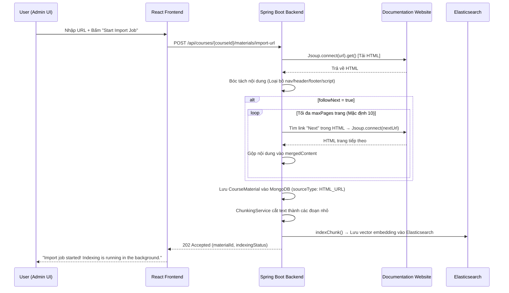

# Kiến Trúc Crawler (Import Website Documentation)

Tài liệu này mô tả chi tiết cách thức hoạt động, cấu trúc mã nguồn, và luồng dữ liệu của hệ thống cào dữ liệu web (Web Crawler) trong dự án AI Tutor.

> **Phiên bản hiện tại: Backend Crawl (Java/Jsoup)**
> Toàn bộ quá trình cào dữ liệu được thực hiện 100% tại Backend (Spring Boot). Frontend chỉ đóng vai trò gửi URL và hiển thị kết quả.

---

## 1. Tổng Quan Quy Trình (Data Flow)



---

## 2. Chiến Thuật Cào Dữ Liệu (Crawl Strategy)

### 2.1. Jsoup — Thư viện cào web của Java
Backend sử dụng **Jsoup** (`org.jsoup:jsoup:1.17.2`) để tải và phân tích HTML. Jsoup hoạt động như một HTTP client thuần túy (không chạy JavaScript), nhưng đủ mạnh để cào hầu hết các trang tài liệu tĩnh (Oracle Docs, MDN, Spring.io...).

```java
Document doc = Jsoup.connect(uri.toString())
    .userAgent("AI-Tutor-Platform/1.0 (+course-material-import)")
    .timeout(20_000)  // 20 giây timeout
    .followRedirects(true)
    .get();
```

### 2.2. Bóc tách nội dung thông minh (Content Extraction)
Sau khi tải HTML, BE tự động:
1. **Loại bỏ rác**: Xóa các thẻ `<script>`, `<style>`, `<nav>`, `<header>`, `<footer>`, `.toc`, `.breadcrumbs`.
2. **Tìm vùng nội dung chính**: Ưu tiên theo thứ tự: `<main>` → `<article>` → `.chapter` → `.section` → `<body>`.
3. **Trích xuất title**: Ưu tiên: `<h1>` → `<title>` → URL.
4. **Chuẩn hóa text**: Xóa khoảng trắng thừa, dòng trống liên tiếp.

### 2.3. Tự động dò link "Next" (Auto-Follow)
Khi người dùng bật tùy chọn **"Follow Next links"**, BE sẽ:
1. Tìm thẻ `<a>` có thuộc tính `rel="next"`, `accesskey="n"`, hoặc text chứa từ "Next".
2. Kiểm tra link đó có cùng domain (host) với URL gốc không (tránh nhảy sang trang ngoài).
3. Lặp lại quá trình tải + bóc tách cho trang tiếp theo.
4. Dừng lại khi đạt `maxPages` (mặc định 10, tối đa 10) hoặc không tìm thấy link "Next" nào nữa.

---

## 3. Cấu Trúc Mã Nguồn (Code Structure)

### Backend (Java Spring Boot)

```text
ai-tutor-api/src/main/java/com/ragapi/
 ├─ controller/
 │   └─ CourseMaterialController.java     # API endpoint: POST /courses/{courseId}/materials/import-url
 │                                         # Nhận request, gọi resolveUploadScope(), gọi htmlImportService
 ├─ dto/
 │   └─ ImportCourseMaterialUrlRequest.java # DTO: url, title, followNext, maxPages, classId, teacherId, uploaderRole
 ├─ service/
 │   ├─ CourseMaterialHtmlImportService.java # ★ Logic cào chính: Jsoup fetch, bóc tách HTML, dò link Next, gộp text
 │   ├─ CourseMaterialIngestionService.java  # Lưu MongoDB + Gọi ChunkingService + Index Elasticsearch
 │   ├─ CourseMaterialChunkingService.java   # Cắt text thành chunks (theo Heading hoặc đoạn văn, mỗi chunk ≤ 1000 ký tự)
 │   └─ ElasticVectorService.java            # Gửi chunk lên Elasticsearch để tạo vector embedding
 └─ entity/
     └─ CourseMaterial.java                  # Entity MongoDB: sourceType="HTML_URL", content=merged text
```

### Frontend (React)

```text
ai-tutor-frontend/src/
 ├─ components/importWebsite/
 │   └─ ImportWebsiteModal.jsx   # Form đơn giản: URL input, Title input, Follow Next checkbox, Max Pages
 │                                # Gọi apiService.importCourseMaterialUrl() → POST lên BE
 └─ services/
     └─ api.js                   # Hàm importCourseMaterialUrl(courseId, payload)
```

> **Lưu ý:** Toàn bộ logic cào web cũ ở Frontend (useCrawler.js, proxyApi.js, extractor.js, pdfGenerator.jsx, crawler.js, markdown.js) đã được **xóa hoàn toàn**. Frontend không còn thực hiện bất kỳ thao tác cào web nào.

---

## 4. So Sánh Kiến Trúc Cũ vs Mới

| Tiêu chí | FE Crawl (Cũ) | BE Crawl (Hiện tại) |
|---|---|---|
| Nơi thực thi | Trình duyệt người dùng | Java Spring Boot Server |
| Thư viện cào | fetch() + CORS Proxy + Jina AI | Jsoup (Java) |
| Vượt CORS | Cần Cloudflare Worker + Multi-Proxy Rotation | Không cần (Server-side không bị CORS) |
| Định dạng lưu trữ | Tạo file PDF (jsPDF) → Upload lên BE | Lưu trực tiếp text vào MongoDB |
| Chunking | BE dùng PDFTextStripper moi text từ PDF (hay bị lỗi) | BE chunk trực tiếp từ text gốc (chuẩn xác) |
| Tải file PDF | Có file PDF trong GridFS | Không có file PDF (sourceType: HTML_URL) |
| Rủi ro bị chặn IP | Thấp (mỗi user = 1 IP khác nhau) | Cao hơn (tất cả request từ 1 IP server) |
| Độ phức tạp FE | ~2000 dòng code (7 file) | ~150 dòng code (1 file + 1 API method) |

---

## 5. Giới Hạn Hiện Tại

1. **Không chạy JavaScript**: Jsoup chỉ tải HTML tĩnh. Các trang SPA (Single Page App) render bằng React/Angular sẽ trả về trang trắng.
2. **Giới hạn 10 trang/lần import**: `MAX_ALLOWED_PAGES = 10` được hard-code trong `CourseMaterialHtmlImportService`.
3. **Không có file PDF**: Material loại `HTML_URL` không có file PDF để tải xuống. Nút Download trên FE sẽ hiện thông báo thay vì tải file.
4. **Rủi ro bị chặn IP Server**: Nếu nhiều người dùng cùng import từ Oracle Docs, IP của server có thể bị chặn bởi WAF.
