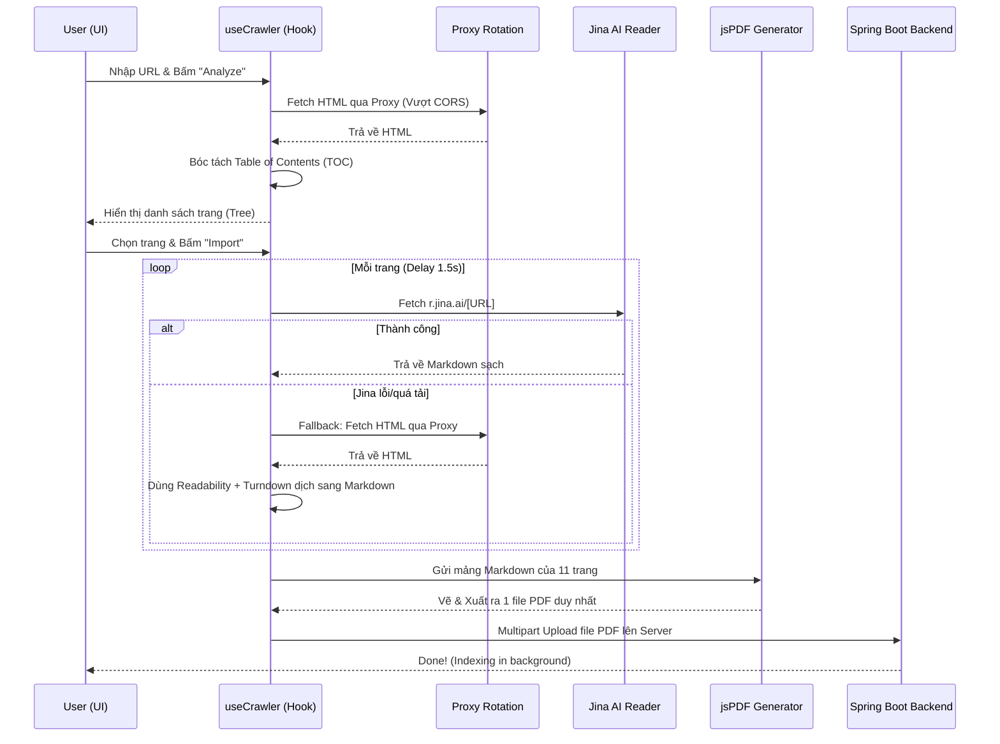

# Kiến Trúc Crawler (Import Website Documentation)

Tài liệu này mô tả chi tiết cách thức hoạt động, chiến thuật vượt tường lửa (WAF/CORS), và cấu trúc mã nguồn của hệ thống cào dữ liệu web (Web Crawler) được nhúng trực tiếp trên Frontend của dự án AI Tutor.

---

## 1. Tổng Quan Quy Trình (Data Flow)

Toàn bộ quy trình cào dữ liệu được thực thi 100% tại trình duyệt của người dùng (Frontend), không yêu cầu Backend phải chạy Puppeteer hay bất kỳ thư viện cào web chuyên dụng nào.



---

## 2. Chiến Thuật Cào Dữ Liệu (Crawl Strategy)

Vì Frontend bị giới hạn bởi chính sách bảo mật của trình duyệt (CORS) và dễ bị các trang bị chặn bởi WAF (như Akamai của Oracle, Cloudflare), Crawler sử dụng 3 chiến thuật cốt lõi:

### 2.1. Vượt CORS & WAF bằng "Multi-Proxy Rotation" (Giai đoạn Analyze)
Khi phân tích mục lục (Table of Contents), hệ thống cần tải HTML thô. Trình duyệt không thể gọi thẳng `fetch(oracle.com)` do CORS.
- Hàm `fetchViaProxy` được thiết kế để tự động xoay tua (Fallback) qua 4 tầng Proxy khác nhau:
  1. `VITE_CORS_PROXY_URL` (Cloudflare Worker tự build - ưu tiên 1).
  2. `api.allorigins.win` (Máy chủ cực mạnh giúp vượt WAF).
  3. `corsproxy.io`
  4. `api.codetabs.com`
- Nếu Proxy 1 bị Oracle chặn (trả về 403 Access Denied), code sẽ âm thầm nuốt lỗi và tự động thử Proxy 2. Điều này đảm bảo tỷ lệ lấy được HTML mục lục gần như 100%.

### 2.2. Bóc tách nội dung cực mạnh bằng Jina AI Reader (Giai đoạn Extract)
Thay vì tải HTML và tự lọc rác (Menu, Quảng cáo, Footer), Crawler ủy quyền việc này cho dịch vụ đám mây **Jina AI Reader**.
- Gọi API: `https://r.jina.ai/[URL]`
- **Lợi ích:** Jina tự động chạy một Headless Browser (Puppeteer ngầm) trên server của họ, tự đợi Javascript render xong, lách qua mọi Captcha, bóc tách đúng nội dung bài học và trả về thẳng định dạng **Markdown** (rất hoàn hảo cho RAG Vector Search).

### 2.3. Nhịp nghỉ mô phỏng con người (Anti-Bot Delay)
Trong vòng lặp tải hàng loạt trang web (ví dụ: 11 trang của Oracle), hệ thống được hard-code một khoảng trễ `await delay(1500)` (1.5 giây) giữa các lần fetch.
- Việc này giúp Crawler "giả vờ" giống như một người dùng thật đang bấm chuyển trang từ từ.
- Ngăn chặn triệt để việc bị hệ thống bảo mật của trang chủ đánh dấu là tấn công DDoS/Bot và chặn IP vĩnh viễn.

---

## 3. Cấu Trúc Mã Nguồn (Directory Structure)

Toàn bộ logic nằm trong thư mục `src/services/websiteImport/` và `src/hooks/useCrawler.js`.

### Cấu trúc file
```text
src/
 ├─ hooks/
 │   └─ useCrawler.js           # Bộ não trung tâm: quản lý State (tiến độ, lỗi), điều phối vòng lặp tải trang và delay.
 └─ services/websiteImport/
     ├─ crawler.js              # Xử lý Analyze: Chứa class WebsiteCrawler để tải HTML qua proxy và bóc tách cấu trúc Cây mục lục (TOC/Links). Có hỗ trợ override theo từng Domain (VD: OracleCrawler).
     ├─ extractor.js            # Xử lý Extract: Nhận 1 URL, ưu tiên gọi Jina AI. Nếu rớt mạng thì Fallback gọi Proxy lấy HTML rồi chuyển cho markdown.js.
     ├─ proxyApi.js             # Logic Multi-Proxy Rotation: Chứa danh sách các server CORS proxy dự phòng và xử lý timeout/error.
     ├─ markdown.js             # Dùng thư viện Mozilla Readability (lọc rác HTML) + Turndown (biến HTML sạch thành Markdown). Chỉ dùng khi Fallback.
     ├─ pdfGenerator.jsx        # Đóng gói PDF: Dùng thư viện jsPDF. Nhận mảng n trang Markdown, "in" từng dòng chữ lên Canvas PDF (để tránh lỗi crash Yoga Flexbox của thư viện React-PDF cũ).
     └─ upload.js               # Đóng gói FormData và gọi API POST lên Spring Boot Backend.
```

---

## 4. Quá Trình Fallback (Graceful Degradation)

Điều làm nên độ bền bỉ của kiến trúc này là khả năng tự phục hồi khi gặp lỗi:

1. **Khi Jina AI sập/hết lượt:** Hàm `extractPageMarkdown` trong `extractor.js` sẽ bắt lỗi `catch` -> Gọi lại `WebsiteCrawler.extractPage` -> Chạy qua Proxy Rotation -> Lấy HTML -> Chạy Readability -> Ra Markdown.
2. **Khi Cloudflare Worker bị chặn (403):** Hàm `fetchViaProxy` trong `proxyApi.js` bắt lỗi -> Đổi sang dùng `allorigins.win`.
3. **Khi gặp mã HTML dị dạng:** Sinh ra lỗi Yoga Crash ở `React-PDF` trước đây -> Hiện tại đã thay bằng `jsPDF`, in chữ thô lên tọa độ XY nên không bao giờ bị Crash Layout.

Nhờ kiến trúc đa lớp này, chức năng Import Web hoàn toàn có thể hoạt động độc lập không cần phụ thuộc vào một máy chủ Node.js Crawler riêng biệt nào.
