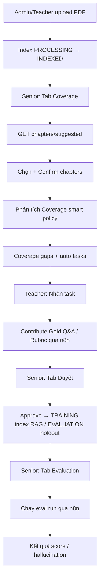

# Hướng dẫn UI/UX — Expert Co-Training V2 (FE Website)

Tài liệu dành cho team **FE Website** implement luồng **Expert Co-Training V2** trên web, **parity với mobile Flutter** hiện tại (`V2ExpertHubScreen`, `ExpertTaskBoardScreen`, `ExpertContributeScreen`).

**Backend:** Spring Boot `:8085`  
**n8n webhooks:** `:5678/webhook` (một số bước AI/proxy)  
**Auth:** `Authorization: Bearer <JWT>`  
**Swagger:** `/swagger-ui.html`  
**WebSocket events:** `ws(s)://<host>/ws/events?token=<JWT>`

**Tài liệu liên quan:**

| File | Nội dung |
|---|---|
| `FE_WEBSITE_MATERIAL_COVERAGE_UIUX_GUIDE_VI.md` | Upload/index PDF, TOC bookmark, preview chapter, WebSocket material |
| `TUTOR_V2_IMPLEMENTATION_AND_TEST_GUIDE_VI.md` | API chi tiết, test harness |
| `FRONTEND_N8N_INTEGRATION_GUIDE.md` | n8n webhook chung |

---

## 1. Parity mobile ↔ web

Mobile đã có **2 entry point** V2. Web nên map tương ứng:

| Mobile route | Role | Web route đề xuất | Màn hình |
|---|---|---|---|
| `/t/expert-tasks` | TEACHER | `/teacher/expert-tasks` | Bảng task mentor |
| `/t/expert-tasks/:id/contribute` | TEACHER | `/teacher/expert-tasks/:id/contribute` | Form đóng góp |
| `/t/v2` | SENIOR_MENTOR | `/senior/v2` | Hub V2 (3 tab) |
| `/a/v2` | ADMIN | `/admin/v2` | Cùng UI hub V2 |

### Hub V2 — 3 tab (Senior / Admin)

Giống mobile `V2ExpertHubScreen`:

| Tab | Label mobile | Nội dung |
|---|---|---|
| 1 | **Coverage** | Chapter gợi ý, confirm, phân tích gap, tạo task |
| 2 | **Duyệt** | Gold Q&A + Rubric `PENDING_REVIEW` |
| 3 | **Evaluation** | Chạy eval harness, xem lịch sử run |

**Luôn có:** thanh chọn **Môn học** (`courseId`) phía trên nội dung tab.

---

## 2. Vai trò & menu

| Role | Vào được | Không vào |
|---|---|---|
| **STUDENT** | — | Toàn bộ V2 |
| **TEACHER** | Expert Tasks, Contribute | Tab Coverage / Duyệt / Eval hub |
| **SENIOR_MENTOR** | Hub V2 (3 tab), xem task | — |
| **ADMIN** | Hub V2 + upload material course (xem guide material) | — |

**Guard route:** redirect 403 → trang “Không có quyền” + nút về dashboard.

---

## 3. Luồng nghiệp vụ end-to-end



**Quy tắc Gold Q&A (hiển thị rõ trên UI):**

| `usage` | Label UI (mobile) | Sau khi Senior duyệt |
|---|---|---|
| `TRAINING` | TRAINING • index RAG sau duyệt | Đưa vào knowledge base / RAG |
| `EVALUATION` | EVALUATION • holdout, không index RAG | Chỉ dùng benchmark eval |

---

## 4. Phân tách API: Spring vs n8n

FE web **bắt buộc** dùng 2 client (giống mobile `springDio` + `n8nDio`):

| Hành động | Gọi qua | Endpoint |
|---|---|---|
| List/confirm chapter, preview, gaps, tasks CRUD | **Spring** `:8085` | `/api/v2/expert-training/...` |
| Phân tích coverage | **n8n** | `POST /webhook/v2-coverage-analyze` |
| Submit Gold Q&A | **n8n** | `POST /webhook/v2-gold-qa-submit` |
| Submit Rubric | **n8n** | `POST /webhook/v2-rubric-submit` |
| Approve Gold Q&A | **n8n** | `POST /webhook/v2-gold-qa-approve` |
| Approve Rubric | **n8n** | `POST /webhook/v2-rubric-approve` |
| Chạy Evaluation | **n8n** | `POST /webhook/v2-eval-run` |
| List eval runs (read) | **Spring** | `GET /api/v2/expert-training/eval-runs` |

**Timeout gợi ý (khớp mobile):**

| Client | Receive timeout |
|---|---|
| Spring CRUD | 30s |
| n8n AI / coverage | 120s |
| n8n approve Gold QA | 240s |
| n8n eval run | **300s** (5 phút) |

Hiển thị **progress overlay** + nút “Vẫn chạy nền” khi eval > 30s.

---

## 5. Màn hình A — Expert Tasks (Teacher)

**Route web:** `/teacher/expert-tasks`  
**Mobile:** `ExpertTaskBoardScreen`

### Layout

```
┌─ Expert Tasks V2 ──────────────────────────────────────────┐
│ Course: [PRJ301 ▼]                                            │
├───────────────────────────────────────────────────────────────┤
│ [ Cần làm ]  [ Đã xong ]                                      │
├───────────────────────────────────────────────────────────────┤
│ ┌─ Card task ────────────────────────────────────────────────┐ │
│ │ Gold Q&A — Servlet Lifecycle          [Chưa nhận]        │ │
│ │ TRAINING • index RAG sau duyệt • Chương 3                │ │
│ │ Hướng dẫn: Viết 2 câu hỏi tình huống...                   │ │
│ │ Người nhận: Chưa có người nhận                             │ │
│ │ [ Nhận task ]                                               │ │
│ └─────────────────────────────────────────────────────────────┘ │
└───────────────────────────────────────────────────────────────┘
```

### API

```http
GET /api/v2/expert-training/tasks?courseId={courseId}
POST /api/v2/expert-training/tasks/{taskId}/assign
Body: { "assigneeId": "<userId>", "assigneeTier": "TEACHER" }
```

### Task card — trường hiển thị

| Field | UI |
|---|---|
| `title` hoặc `chapter` | Tiêu đề card |
| `type` | `GOLD_QA` / `RUBRIC` |
| `status` | Badge (bảng §8) |
| `usageLabel` (derive từ title/instructions) | Subtitle |
| `chapter` | Subtitle |
| `instructions` | Body, max 3 dòng desktop / expandable |
| `assigneeId` | “Người nhận: Bạn” / “Chưa có…” / “Mentor khác…” |
| `priority` | Sort giảm dần (mobile `compareExpertTasks`) |

### Hành động theo trạng thái

| Điều kiện | Nút / hành vi |
|---|---|
| `OPEN` + chưa assignee | **Nhận task** → POST assign |
| `ASSIGNED`/`IN_PROGRESS` + assignee = mình | **Đóng góp** → navigate contribute |
| `SUBMITTED` | Toast: “Task đang chờ Senior duyệt.” — không mở form |
| assignee khác | “Mentor khác đang xử lý” — disabled |
| Tab **Đã xong** | Read-only, mở contribute nếu vẫn được (mobile cho phép xem) |

### Empty states

| Tab | Title | Message |
|---|---|---|
| Cần làm | Không có task đang mở | Senior chạy Coverage Analyze để tạo task training/evaluation. |
| Đã xong | Chưa có task hoàn thành | Task đã duyệt xong sẽ hiện ở đây. |

---

## 6. Màn hình B — Đóng góp (Teacher)

**Route:** `/teacher/expert-tasks/:taskId/contribute`  
**Mobile:** `ExpertContributeScreen`

### Layout (2 cột desktop ≥1024px)

```
┌─ Đóng góp V2 ─────────────────────────────────────────────────────────┐
│ ← Back                                                                  │
├──────────────────────────────┬────────────────────────────────────────┤
│ FORM (trái 480px)            │ TÀI LIỆU CHƯƠNG (phải, sticky)         │
│                              │                                         │
│ {task.title}                 │ ▼ Tài liệu chương (từ giáo trình)      │
│ {usageLabel} • {chapter}     │ {title} • PDF_BOOKMARK • N chunks       │
│ [Hướng dẫn task - callout]   │ Nguồn: [Material A] [Mở PDF]           │
│                              │ ─────────────────────────────           │
│ Usage cố định: TRAINING      │ Nội dung mục đã map (scroll)            │
│ Câu hỏi [textarea]           │ {excerpt selectable}                    │
│ Gold answer [textarea]       │                                         │
│ [ Gửi qua n8n ]              │                                         │
└──────────────────────────────┴────────────────────────────────────────┘
```

### Panel tài liệu chương

**API (luôn `expanded=true`):**

```http
GET /api/v2/expert-training/chapters/preview?courseId=&chapter={task.chapter}&expanded=true
```

| Trường response | UI |
|---|---|
| `excerpt` | `user-select: text`, scroll max-height 420px |
| `excerptTruncated` + `excerptTotalChars` | Banner: “Bản rút gọn (x/y ký tự). Mở PDF…” |
| `sourceMaterials[]` | List + nút **Mở PDF** → `GET /api/courses/{courseId}/materials/{id}/pdf` |
| Không có material | Empty: “Chapter không map từ giáo trình… tham khảo giáo trình gốc” |

### Form Gold Q&A (`type = GOLD_QA`)

| Field | Validation |
|---|---|
| Câu hỏi | Required, trim |
| Gold answer | Required, trim |
| `usage` | **Read-only** — lấy từ task (`TRAINING` / `EVALUATION`), không cho mentor đổi |

**Submit:**

```http
POST {N8N}/v2-gold-qa-submit
{
  "courseId", "chapter", "question", "goldAnswer",
  "usage", "difficulty": "MEDIUM",
  "authorId", "sourceTaskId"
}
```

Success → toast **“Đã nộp — chờ Senior duyệt”** → quay task board.

### Form Rubric (`type = RUBRIC`)

| Field | Ghi chú |
|---|---|
| Tên rubric | Required |
| Mô tả | Textarea |
| accuracy, groundedness, guidance | Number; **tổng = 1.0** |

```http
POST {N8N}/v2-rubric-submit
{ "criteriaWeights": { "accuracy": 0.6, "groundedness": 0.3, "guidance": 0.1 }, ... }
```

### Guard — không cho đóng góp

Hiển thị empty (giống mobile):

| Tình huống | Message |
|---|---|
| Task đóng | Task đã đóng. |
| SUBMITTED | Task đang chờ Senior duyệt. |
| OPEN chưa nhận | Hãy nhận task trước khi soạn Gold Q&A hoặc rubric. |
| Mentor khác | Task đã được mentor khác nhận. |

---

## 7. Màn hình C — Hub V2 (Senior / Admin)

**Route:** `/senior/v2` hoặc `/admin/v2`  
**Mobile:** `V2ExpertHubScreen`

### Shell chung

- **Header:** Expert Co-Training V2
- **Tabs:** Coverage | Duyệt | Evaluation
- **Course picker:** dropdown `courseId` (web: load từ API courses thay vì hardcode PRJ301…)
- **Deep link:** `/senior/v2?courseId=PRJ301&tab=coverage`

---

### Tab 1 — Coverage

#### Phần 1: Chapters gợi ý

**API:**

```http
GET /api/v2/expert-training/chapters/suggested?courseId=
```

**List item (checkbox + indent):**

| Data | Hiển thị |
|---|---|
| `title` | Title, indent `tocLevel × 16px` |
| `detectedFrom` | `PDF_BOOKMARK` / `MATERIAL_TITLE` / `MANUAL` |
| `chunkCount`, `approxChars` | Metadata subtitle |
| `pageStart`–`pageEnd` | `p.10-39` nếu > 0 |
| `trainingGoldCount` / `evaluationGoldCount` | `Gold T/E: 2/1` |
| `materialHealth` | Badge §8 |

**Click row / icon preview** → **Drawer phải** (desktop) hoặc **modal full** (mobile web):

```http
GET /api/v2/expert-training/chapters/{chapterKey}/preview?courseId=&expanded=true
```

Drawer content (giống mobile bottom sheet):

- Title, badge health, nguồn, excerpt selectable
- Nút **Mở PDF** từng `sourceMaterials`
- CTA **Tạo task Gold Q&A cho chapter này** → `POST /chapters/tasks`

**Actions hàng loạt:**

| Nút | API |
|---|---|
| Thêm chapter thủ công | Dialog input title → `POST /chapters/manual` |
| Xác nhận chapters | `POST /chapters/confirm` body `{ courseId, chapterKeys[], confirmedBy }` |
| Refresh | Re-fetch suggested |
| Phân tích Coverage (smart policy) | n8n `v2-coverage-analyze` |

**Payload analyze (mobile defaults):**

```json
{
  "courseId": "PRJ301",
  "chapters": ["Chapter 1: ...", "1.1 ..."],
  "requestedBy": "<userId>",
  "minimumTrainingGoldPerChapter": 0,
  "minimumEvaluationGoldPerChapter": 0,
  "createTasks": true,
  "smartTaskPolicy": true,
  "useSuggestedOrConfirmedChapters": true,
  "includeTrainingGoldTasks": false,
  "includeBenchmarkTasks": false
}
```

Nếu user đã chọn checkbox → gửi `chapters` = **title** của chapter đã chọn (không phải `chapterKey`).

#### Phần 2: Coverage gaps

**API list:**

```http
GET /api/v2/expert-training/coverage-gaps?courseId=
```

**Gap card:**

| Field | UI |
|---|---|
| `chapter` | Title |
| `trainingGoldCount` / `evaluationGoldCount` | Training: N • Eval: M |
| `materialHealth` | Badge |
| `chunkCount`, `approxChars` | Material stats |
| `reasons[]` | Bullet list |
| `severity`, `status` | Badges |

**CTA:** “Tạo task Gold Q&A (senior)” — chỉ khi `status !== TASK_CREATED`

```http
POST /api/v2/expert-training/chapters/tasks
{
  "courseId", "chapter", "createdBy",
  "includeTrainingGoldTask": true,
  "includeEvaluationGoldTask": true
}
```

#### Empty / error Coverage

| Case | UI |
|---|---|
| Chưa có chapter | Upload và index giáo trình trước, sau đó refresh. |
| 403 chapters API | “Rebuild backend / đăng nhập lại với SENIOR_MENTOR hoặc ADMIN.” |

---

### Tab 2 — Duyệt

**API read (Spring):**

```http
GET /api/v2/expert-training/gold-qa?courseId=&status=PENDING_REVIEW
GET /api/v2/expert-training/rubrics?courseId=
→ lọc client status === PENDING_REVIEW
```

**Layout:** stack card; desktop có thể 2 cột.

**Gold Q&A card:**

- Header: `Gold Q&A • {usage}`
- Body: `question` (+ optional expand `goldAnswer`)
- Field **Ghi chú duyệt** (default: “Đã đối chiếu với giáo trình.”)
- Nút **Duyệt Gold Q&A** → n8n approve

```http
POST {N8N}/v2-gold-qa-approve
{ "goldQaId", "reviewerId", "reviewerRole", "reviewNote" }
```

**Rubric card:** tương tự → `v2-rubric-approve`

**Empty:** “Không có mục chờ duyệt — Teacher nộp Gold Q&A hoặc Rubric trước.”

**Sau approve:** invalidate list + toast; WebSocket có thể push `GOLD_QA_APPROVED` / `RUBRIC_APPROVED`.

---

### Tab 3 — Evaluation

**Form chạy eval:**

| Field | Default mobile |
|---|---|
| Chapter (text) | Tên chapter đã confirm, VD “Spring Boot Basics” |
| passThreshold | 0.6 (hidden hoặc advanced) |

```http
POST {N8N}/v2-eval-run
{
  "courseId", "chapter", "triggeredBy",
  "passThreshold": 0.6,
  "harnessVersion": "v2-mvp",
  "kbVersion": "current",
  "promptVersion": "current"
}
```

**Timeout UI:** disable nút, spinner 5 phút, message “Đang chấm benchmark — có thể mất vài phút.”

**Lịch sử:**

```http
GET /api/v2/expert-training/eval-runs?courseId=
```

**Run card:**

| Field | Hiển thị |
|---|---|
| `chapter`, `status` | Title line |
| `averageScore` | Score 2 chữ thập phân |
| `passedCases` / `totalCases` | Passed x/y |
| `hallucinationRate` | Hallucination rate |
| `regressionDetected` | Badge cảnh báo nếu true |

---

## 8. Badge & trạng thái (copy từ mobile)

### Task `status`

| Value | Label VI |
|---|---|
| `OPEN` | Chưa nhận |
| `ASSIGNED` | Đã giao |
| `IN_PROGRESS` | Đang làm |
| `SUBMITTED` | Chờ duyệt |
| `COMPLETED` | Hoàn thành |
| `CANCELLED` | Đã huỷ |

### Gap `severity` / `status`

| Domain | Value | Label |
|---|---|---|
| gap | `OPEN` | Thiếu dữ liệu |
| gap | `TASK_CREATED` | Đã tạo task |
| gap | `RESOLVED` | Đã xử lý |
| gap | `CRITICAL` | Nghiêm trọng |
| gap | `HIGH` | Cao |
| gap | `MEDIUM` | Trung bình |

### `materialHealth`

| Value | Label | Màu |
|---|---|---|
| `MATERIAL_OK` | Material OK | Xanh |
| `MATERIAL_THIN` | Material mỏng | Vàng |
| `NO_MATERIAL` | Chưa có material | Xám |

### `detectedFrom`

| Value | Label |
|---|---|
| `PDF_BOOKMARK` | Mục lục PDF |
| `MATERIAL_TITLE` | Tên tài liệu |
| `MANUAL` | Thêm thủ công |
| `HEADING` | *(ẩn — legacy IGNORED)* |

---

## 9. WebSocket — cập nhật realtime

**Kết nối:** `ws(s)://<host>/ws/events?token=<JWT>`

| Event | Hành động FE |
|---|---|
| `MATERIAL_INDEXING` / `MATERIAL_INDEXED` / failed | Refresh tab Coverage suggested chapters |
| `EXPERT_TASK_ASSIGNED` | Refresh task board (teacher) |
| `GOLD_QA_SUBMITTED` | Refresh tab Duyệt |
| `GOLD_QA_APPROVED` / `REJECTED` | Refresh tasks + review |
| `RUBRIC_SUBMITTED` / `APPROVED` |同上 |
| `EVAL_RUN_COMPLETED` / `EVAL_RUN_FAILED` | Refresh tab Evaluation |

**Ping:** gửi `{ "type": "PING" }` mỗi ~25s; nhận `PONG`.

Không reload trang — invalidate React Query / SWR cache.

---

## 10. Responsive web

### Desktop (≥1280px)

| Màn | Layout |
|---|---|
| Hub V2 | Tab bar + content max-width 1200px centered |
| Coverage | Master-detail: list trái 40%, preview drawer cố định phải 480px |
| Contribute | 2 cột form + material panel |
| Tasks | Grid 2 cột card |

### Tablet (768–1279px)

- Coverage preview: drawer overlay 90vw
- Contribute: 1 cột, material panel collapse phía trên form

### Mobile web (<768px)

- Parity mobile app: bottom sheet preview `72–95vh`
- Tab hub scroll ngang nếu cần
- FAB refresh trên task list

---

## 11. Wireframe — Hub V2 (ASCII)

```
┌─ Expert Co-Training V2 ─────────────── Course: [OSG203 ▼] ─┐
│  Coverage  |  Duyệt  |  Evaluation                           │
├──────────────────────────────────────────────────────────────┤
│ Chapters gợi ý từ giáo trình đã index                        │
│ Gợi ý từ mục lục PDF (bookmark) hoặc tên tài liệu.          │
│ [ + Thêm chapter thủ công ]                                  │
│                                                              │
│ ☑ Ch 1 Introduction              [Material OK]    p.10-39  │
│ ☑   1.1 Turing Model             [Material OK]    p.12-18  │
│ ☐ Ch 2 Number Systems            [Material OK]    p.40-..  │
│                                                              │
│ [ Xác nhận chapters ]  [↻]   [ Phân tích Coverage ]        │
├──────────────────────────────────────────────────────────────┤
│ Coverage gaps                                                │
│ ┌──────────────────────────────────────────────────────────┐│
│ │ 1.1 WHAT IS AN OS — Training: 0 • Eval: 0  [Cao]       ││
│ │ • Thiếu Gold Q&A training                                ││
│ │ [ Tạo task Gold Q&A (senior) ]                           ││
│ └──────────────────────────────────────────────────────────┘│
└──────────────────────────────────────────────────────────────┘
```

---

## 12. Microcopy tiếng Việt (dùng nguyên văn)

| Key | Text |
|---|---|
| submit_success | Đã nộp — chờ Senior duyệt |
| claim_success | Đã nhận task. |
| confirm_chapters | Đã xác nhận chapters cho V2 |
| analyze_label | Phân tích Coverage (smart policy) |
| create_tasks | Tạo task Gold Q&A cho chapter này |
| send_n8n | Gửi qua n8n |
| run_eval | Chạy Evaluation (n8n) |
| excerpt_truncated | Đang hiển thị bản rút gọn ({n}/{total} ký tự). Mở PDF để xem đầy đủ. |
| no_suggested | Chưa có chapter gợi ý |
| upload_first | Upload và index giáo trình trước, sau đó refresh tab này. |

---

## 13. Anti-patterns

| ❌ Không | ✅ Nên |
|---|---|
| Gọi coverage analyze trực tiếp Spring từ browser nếu prod dùng n8n proxy | Dùng webhook `v2-coverage-analyze` (giống mobile) |
| Preview Coverage với `expanded=false` | Luôn `expanded=true` |
| Cho mentor đổi `usage` TRAINING/EVALUATION | Read-only theo task |
| Block UI 5 phút khi eval không feedback | Spinner + message chờ |
| Hardcode danh sách course | Load courses theo role từ API |
| Bỏ qua WebSocket | Listen events + invalidate cache |

---

## 14. Checklist bàn giao FE Website V2

- [ ] Route guard theo role (Teacher / Senior / Admin)
- [ ] Course picker dùng API thật
- [ ] Hub 3 tab parity mobile
- [ ] Task board 2 tab Cần làm / Đã xong
- [ ] Contribute: panel material `expanded=true` + Mở PDF
- [ ] Gold Q&A usage read-only
- [ ] Rubric weights sum = 1.0 validation
- [ ] n8n vs Spring client tách biệt + đúng timeout
- [ ] WebSocket `/ws/events` invalidate đúng tab
- [ ] Badge/status map đúng bảng §8
- [ ] Empty / error / 403 states có CTA
- [ ] Preview excerpt selectable + scroll
- [ ] Chapter list indent `tocLevel`

---

## 15. API map V2 (Spring read/write)

| Method | Path | Tab / màn |
|---|---|---|
| GET | `/api/v2/expert-training/chapters/suggested` | Coverage |
| POST | `/api/v2/expert-training/chapters/confirm` | Coverage |
| POST | `/api/v2/expert-training/chapters/manual` | Coverage |
| GET | `/api/v2/expert-training/chapters/{key}/preview` | Coverage drawer |
| GET | `/api/v2/expert-training/chapters/preview` | Contribute panel |
| POST | `/api/v2/expert-training/chapters/tasks` | Coverage / gap card |
| GET | `/api/v2/expert-training/coverage-gaps` | Coverage |
| GET | `/api/v2/expert-training/tasks` | Task board |
| POST | `/api/v2/expert-training/tasks/{id}/assign` | Nhận task |
| GET | `/api/v2/expert-training/gold-qa` | Duyệt |
| GET | `/api/v2/expert-training/rubrics` | Duyệt |
| GET | `/api/v2/expert-training/eval-runs` | Evaluation |
| GET | `/api/v2/expert-training/eval-runs/{id}` | Chi tiết run (optional) |

**n8n webhooks:** xem §4.

---

*Tài liệu cập nhật: 2026-03-21 — parity mobile Flutter Expert Co-Training V2 + PDF bookmark chapters.*
